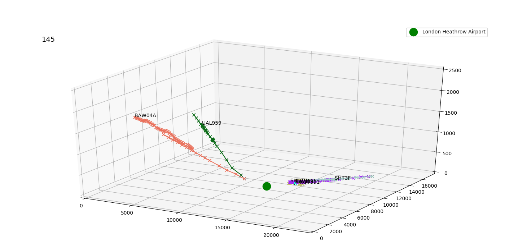

# aircraft_kalman
Source code for my project for Bayesian Machine Learning course, tracking and visualising airplanes trajectories, predicting their position using Kalman filter.

## What does it do
The code in aircraft_kalman.ipynb tracks aircrafts in specified area (configurable) and plots their positions to 3D figure. It uses OpenSkiApi which provides new position data approximatelly every 10-th second. When enough (configurable) real data for an airplain is obtained, it starts predicting airplain's position every second using 3D Kalman filter.

Code in 3D_kalman_filter_demo.ipynb demonstrates usage and features of 3D Kalman filtering.

## Requirements
numpy, scipy, jupyter, matplotlib, [OpenSkiApi](https://github.com/openskynetwork/opensky-api)

## Usage
TL;DR: Run all the cells in aircraft_kalman.ipynb jupyter notebook.

The 3D graph can be rotated using mouse drag'n'drop. Some saved plots are in figs folder.

You can specify the observing area in the third cell (there are some airports predefined and commented out), by default it observes Chicago O'Hare International Airport (but there pre-set commented coordinates of London Heathrow airport and Vaclav Havel's airport in Prague). There you can also set MIN_NUMBER_OF_UPDATES parameter to specify how many times every airplane should be updated with its position until predicting its position using Kalman filter becomes. So if you don't want any predictions, just assign some big number to it.

## Acknowledgement
The code in kf folder is based on a code by my teacher [Mr. Kamil Dedecius](https://github.com/kamil-dedecius) who kindly allowed me to use it.
